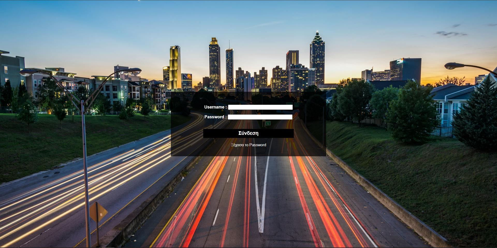

# Login Demo Page

## Επισκόπηση

Αυτή είναι μια απλή σελίδα σύνδεσης (login page) που δημιουργήθηκε για εκπαιδευτικούς σκοπούς. Το έργο χρησιμοποιεί HTML, CSS και JavaScript για την υλοποίηση μιας βασικής φόρμας σύνδεσης. 

## Περιεχόμενα

- [Χρήση](#Χρήση)
- [Σκοπός και Χρήση](#Σκοπός-και-Χρήση)
- [Συνεισφορά](#Συνεισφορά)
- [Άδειες Χρήσης](#Άδειες-Χρήσης)
- [Επικοινωνία](#Επικοινωνία)

## Χρήση
Η σελίδα σύνδεσης περιλαμβάνει πεδία για το όνομα χρήστη και τον κωδικό πρόσβασης. Η φόρμα δεν έχει συνδεθεί με κάποιο backend, οπότε τα δεδομένα δεν αποθηκεύονται ή επεξεργάζονται.

Για να δείτε την επικύρωση της φόρμας:

Εισάγετε δεδομένα στα πεδία.
Πατήστε το κουμπί "Σύνδεση" (Login).
Το JavaScript αρχείο περιλαμβάνει απλή επικύρωση της φόρμας για να ελέγξει αν τα πεδία είναι συμπληρωμένα.

## Σκοπός και Χρήση

Αυτό το έργο είναι κατάλληλο για:

Εκπαιδευτικούς Σκοπούς: Μαθαίνετε πώς να δημιουργείτε φόρμες σύνδεσης με HTML, CSS και JavaScript.
Προσωπικές Προσαρμογές: Χρησιμοποιήστε αυτό το demo ως βάση για τη δημιουργία πιο σύνθετων εφαρμογών σύνδεσης.

## Συνεισφορά

Είστε ευπρόσδεκτοι να συνεισφέρετε στο έργο. Ακολουθήστε τα παρακάτω βήματα για να υποβάλετε αλλαγές:

Φτιάξτε ένα Fork του repository.

Δημιουργήστε ένα Branch για τις αλλαγές σας:

bash
Αντιγραφή κώδικα
git checkout -b my-new-feature
Κάντε Commit τις αλλαγές σας:

bash
Αντιγραφή κώδικα
git commit -am 'Προσθέστε μια νέα δυνατότητα'
Στείλτε ένα Pull Request περιγράφοντας τις αλλαγές σας.

Για οποιοδήποτε πρόβλημα ή πρόταση, μπορείτε να ανοίξετε ένα issue στο GitHub Issues.

## Άδειες Χρήσης
Αυτό το έργο διατίθεται υπό την Άδεια MIT. Δείτε το αρχείο LICENSE για περισσότερες πληροφορίες.

## Επικοινωνία
Για ερωτήσεις ή σχόλια, μπορείτε να ανοίξετε ένα issue στο GitHub repository ή να επικοινωνήσετε με τον δημιουργό μέσω email (info@di-il.gr).

